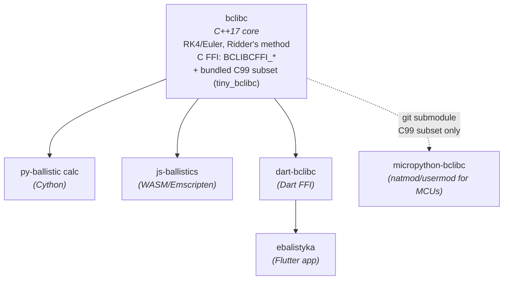

  

# Ballistics Lab

**An open-source ecosystem for small-arms exterior ballistics**

One physics core — point-mass (3‑DoF) trajectory model plus spin drift — implemented once in C/C++ and exposed natively to Python, TypeScript, Dart, and MicroPython.

-----

## Why this exists

Ballistic trajectory math doesn’t change between platforms — only the deployment target does. Instead of re-deriving the physics for every language, this organization keeps a **single C++/C99 core** (`bclibc` / `tiny_bclibc`) and builds thin, idiomatic bindings around it for desktop, mobile, web, and embedded targets. One engine, one set of bugs to fix, many places it runs.

-----

## Projects

### Core engine

#### [bclibc](https://github.com/ballistics-lab/bclibc)

Pure C++ ballistic solver: RK4 and Euler integration, Ridder’s method for zero-finding, and a stable,
versioned C FFI surface (`BCLIBCFFI_*`) consumable from Dart, Python, Rust, or anything with a C ABI.
Builds to a static core (`libbclibc_core`) and a shared FFI lib (`libbclibc_ffi`) for Linux, macOS, and Windows.
The repo also bundles a **C99 subset (`tiny_bclibc`)** of the same engine, used as-is by `micropython-bclibc` via git submodule.

### Embedded / MicroPython

#### [micropython-bclibc](https://github.com/ballistics-lab/micropython-bclibc)

<!--  -->

MicroPython bindings around the `tiny_bclibc` C99 subset bundled in the `bclibc` repo (pulled in as a git submodule),
with three deployment modes: native `.mpy` module (x64/x86, Cortex‑M, Xtensa, RISC‑V),
`usermod` baked directly into firmware (RP2040, ESP32, STM32…), or FFI against `libtiny_bclibc.so` on any Unix port.
Includes a streaming/callback trajectory API for boards with as little as ~200 KB free RAM, plus a float32-vs-float64 precision comparison harness.
*Experimental — APIs may change.*

### Language bindings

#### [py-ballisticcalc](https://github.com/ballistics-lab/py-ballisticcalc)

Python library for ballistic trajectory calculation, with pluggable engines (pure-Python RK4/Euler/Verlet, Cython-accelerated, or SciPy-backed)
and full unit-conversion support across angular, distance, energy, pressure, temperature, velocity and weight dimensions. `pip install py-ballisticcalc`.  

#### [js-ballistics](https://github.com/ballistics-lab/js-ballistics)

TypeScript/JavaScript library powered by the C++ core compiled to WebAssembly via Emscripten — runs in Node.js
or directly in the browser (CDN-ready, no build step). Supports wind layers, multi-BC drag models, Coriolis effect,
danger-space, and powder-temperature sensitivity. npm install js-ballistics.

#### [dart-bclibc](https://github.com/ballistics-lab/dart-bclibc)

Thin, zero-copy Dart FFI wrapper around `libbclibc_ffi`, bundling the `bclibc` C++ source as a git submodule (no pre-built binaries required).
Covers the full solver surface — trajectory integration, zero-angle/apex/max-range solving, sight corrections, energy/OGW — plus a typed
unit system (`Distance`, `Velocity`, `Temperature`, …). Supports Linux, Windows, macOS, Android, and iOS. `dart pub add dart_bclibc`. Beta software.

### Applications

#### [ebalistyka](https://github.com/ballistics-lab/ebalistyka)

Cross-platform ballistic calculator app (Linux, Windows, Android — macOS/iOS in progress) built with Flutter, consuming `bclibc` through the
[dart_bclibc](https://github.com/ballistics-lab/dart-bclibc) wrapper. Shooting profiles, trajectory tables, an SVG mil-reticle with live
drop/windage indication, and profile import/export. Alpha software.

-----

## Shared concerns across the ecosystem

- **One physics model.** Atmosphere density, Coriolis effect, drag-curve interpolation (PCHIP), and cant correction are implemented once in C++/C99; every binding just marshals data in and out.
- **Precision tiers.** Where it matters for embedded targets, both `float32` and `float64` builds are validated against each other (see `micropython-bclibc`’s precision-comparison suite).

-----

> [!WARNING]
> 
> ### Risk notice
> 
> These libraries perform approximate simulations of complex physical processes.
> Calculation results **must not** be considered a complete or fully reliable reflection of actual projectile behavior.
> Use for educational purposes only — results must not be relied upon in any context where an incorrect calculation
> could cause financial harm or put a human life at risk. Code is provided “AS IS”, without warranty of any kind.
> See each repository’s README for the full notice.

-----

[bclibc](https://github.com/ballistics-lab/bclibc) · [micropython-bclibc](https://github.com/ballistics-lab/micropython-bclibc) · [py-ballisticcalc](https://github.com/ballistics-lab/py-ballisticcalc) · [js-ballistics](https://github.com/ballistics-lab/js-ballistics) · [dart_bclibc](https://github.com/ballistics-lab/dart-bclibc) · [ebalistyka](https://github.com/ballistics-lab/ebalistyka)

  <small>
    © 2026 <a href="https://github.com/ballistics-lab">Ballistics Lab</a> · Ukraine 🇺🇦
  </small>

